# GitHub Codespace Einrichtung mit Ollama - Installationsanleitung

## Einleitung

Diese Anleitung bietet eine schrittweise Anleitung zur Einrichtung und Ausführung von Ollama in einer GitHub Codespace-Umgebung.  Sie lernen, wie Sie ein Repository forken, einen Codespace erstellen, notwendige Erweiterungen installieren und Ollama ausführen, um mit KI-Modellen zu interagieren.

## Schritt 1: Bei GitHub anmelden

Die Authentifizierung ist erforderlich, um auf die Funktionen von GitHub zuzugreifen, einschließlich des Forkens von Repositories und der Erstellung von Codespaces.  Ohne Anmeldung können Sie keine eigene Kopie des Repositories erstellen oder eine Entwicklungsumgebung starten.

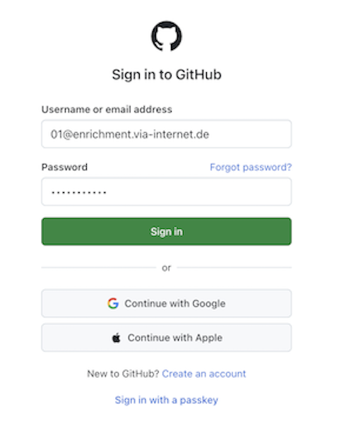

**Detaillierte Schritte:**

- Öffnen Sie Ihren Webbrowser und gehen Sie zu <https://github.com>
- Klicken Sie auf die Schaltfläche "Sign in" in der oberen rechten Ecke
- Geben Sie Ihren GitHub-Benutzernamen oder Ihre E-Mail-Adresse ein
- Geben Sie Ihr Passwort ein
- Wenn Sie die Zwei-Faktor-Authentifizierung (2FA) aktiviert haben, führen Sie den zusätzlichen Verifizierungsschritt durch
- Klicken Sie auf "Sign in", um auf Ihr GitHub-Konto zuzugreifen

## Schritt 2: Dashboard

Das Dashboard bietet einen Überblick über Ihre GitHub-Aktivitäten und dient als zentrale Navigationszentrale.  Von hier aus können Sie auf alle Ihre Repositories zugreifen, Aktivitäten überwachen und nach neuen Projekten suchen.

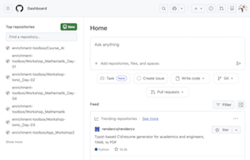

**Beschreibung:**

Nach der Anmeldung sehen Sie Ihr GitHub-Dashboard - Ihre personalisierte Startseite auf GitHub.

**Detaillierte Schritte:**

- Betrachten Sie die Navigationsleiste oben mit Optionen wie Pull Requests, Issues, Codespaces, Marketplace und Explore
- Beachten Sie die linke Seitenleiste mit Ihren aktuellen Repositories und Teams
- Sehen Sie sich den Aktivitäts-Feed in der Mitte an, der Updates von Repositories zeigt, denen Sie folgen
- Prüfen Sie die rechte Seitenleiste auf trendende Repositories und Empfehlungen

## Schritt 3: Repository suchen

Um mit Ollama in einem Codespace zu arbeiten, müssen Sie das entsprechende Repository finden, das die Setup-Skripte und die Konfiguration enthält.

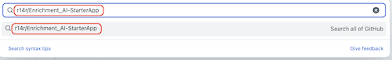

**Detaillierte Schritte:**

- Finden Sie die Suchleiste oben auf der GitHub-Seite (linke Seite der Navigationsleiste)
- Klicken Sie in das Suchfeld
- Geben Sie den Repository-Namen ein, nach dem Sie suchen (z.B. "Enrichment_AI-Installation-Guides" oder den spezifischen Repository-Namen)
- Die Suche beginnt automatisch, während Sie tippen
- Sie können auch Filter wie `user:benutzername` oder `org:organisation` hinzufügen, um die Ergebnisse einzugrenzen

## Schritt 4: Liste der gesuchten Repositories

GitHub zeigt Suchergebnisse mit Repositories an, die Ihrer Anfrage entsprechen, zusammen mit relevanten Informationen zu jedem.

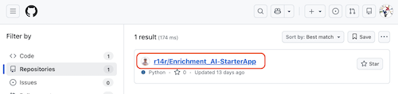

**Detaillierte Schritte:**

- Überprüfen Sie die Liste der Repositories, die von Ihrer Suche zurückgegeben wurden
- Jedes Ergebnis zeigt:
  - Repository-Name und Eigentümer
  - Beschreibung des Repositories
  - Verwendete Programmiersprachen
  - Anzahl der Sterne und Forks
  - Zeitstempel der letzten Aktualisierung
- Verwenden Sie die Filter auf der linken Seite, um Ergebnisse nach Sprache, Sternen oder anderen Kriterien zu verfeinern
- Identifizieren Sie das richtige Repository basierend auf der Beschreibung und dem Eigentümer

## Schritt 5: Ausgewähltes Repository

Sie haben auf das Repository aus den Suchergebnissen geklickt und sehen nun dessen Hauptseite.

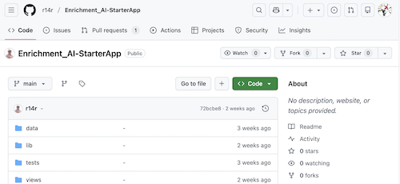

**Detaillierte Schritte:**

- Beachten Sie den Repository-Namen und Eigentümer oben
- Überprüfen Sie den darunter angezeigten README.md-Inhalt (falls verfügbar)
- Beachten Sie die Repository-Statistiken:  Sterne, Beobachter und Forks
- Überprüfen Sie den Abschnitt "About" auf der rechten Seite für eine Projektbeschreibung
- Durchsuchen Sie die Dateistruktur, die Ordner und Dateien im Repository zeigt
- Suchen Sie nach wichtigen Dateien wie README.md, Setup-Skripten oder Dokumentation

## Schritt 6: Repository forken - Button

Um eine eigene Kopie des Repositories zu erstellen, in der Sie Änderungen vornehmen können, müssen Sie es forken.  Die Fork-Schaltfläche befindet sich in der oberen rechten Ecke der Repository-Seite.

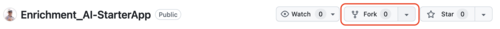

**Beschreibung:**

Forken erstellt eine unabhängige Kopie des Repositories unter Ihrem GitHub-Konto. Dadurch können Sie experimentieren, Änderungen vornehmen und den Code anpassen, ohne das ursprüngliche Repository zu beeinflussen.  Es ist ein grundlegendes Konzept in der kollaborativen Entwicklung.

## Schritt 7: Repository forken - Neuen Fork erstellen

Dieser Konfigurationsschritt ermöglicht es Ihnen, anzupassen, wie das Repository geforkt wird.  Das Kopieren nur des Hauptzweigs hält Ihren Fork schlanker und fokussierter, was normalerweise ausreichend ist, um Installationsanleitungen zu folgen.

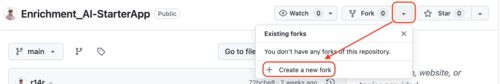

**Detaillierte Schritte:**

- Finden Sie die Schaltfläche "Fork" im oberen rechten Bereich der Repository-Seite
- Die Schaltfläche zeigt ein Fork-Symbol an und kann die aktuelle Anzahl der Forks anzeigen
- Bewegen Sie die Maus über die Fork-Schaltfläche (sie kann beim Hovern zusätzliche Informationen anzeigen)
- Hinweis: Klicken Sie noch nicht, wenn Sie überprüfen möchten, was Forken bedeutet

**Beschreibung:**

Nach dem Klicken auf die Fork-Schaltfläche präsentiert GitHub ein Formular zur Konfiguration Ihres Forks.

## Schritt 9: Neuen Fork erstellen

Dieses visuelle Feedback versichert Ihnen, dass GitHub Ihre Fork-Anfrage aktiv verarbeitet und die Kopie des Repositories erstellt.

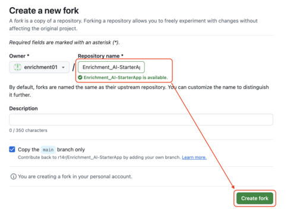

**Beschreibung:**

GitHub zeigt möglicherweise eine Bestätigung oder einen Fortschrittsindikator für den Fork-Erstellungsprozess an.

**Detaillierte Schritte:**

- Die Seite "Create a new fork" erscheint mit mehreren Optionen:
  - **Owner**: Wählen Sie Ihren Benutzernamen oder eine Organisation, der Sie angehören
  - **Repository name**: Behalten Sie den Standard bei oder passen Sie ihn an
  - **Description**: Fügen Sie optional eine Repository-Beschreibung hinzu oder ändern Sie sie
  - **Copy the main branch only**: Kontrollkästchen-Option (normalerweise standardmäßig aktiviert)

- Eine Nachricht wie "Creating fork" oder ähnlich erscheint möglicherweise
- Fortschrittsindikatoren können sichtbar sein
- Warten Sie, bis der Prozess abgeschlossen ist (normalerweise sehr schnell bei kleinen Repositories)

## Schritt 10: Forking

GitHub kopiert die Repository-Struktur, Dateien, Commit-Historie und Zweige, um Ihre unabhängige Kopie zu erstellen. Dadurch wird sichergestellt, dass Sie eine vollständige funktionierende Version des Codes haben.

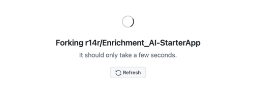

**Beschreibung:**

Der Forking-Prozess ist im Gange, und GitHub zeigt eine Statusmeldung an.

**Detaillierte Schritte:**

- Sie sehen eine Animation oder Nachricht wie "Forking [Repository-Name]..."
- Die Seite zeigt möglicherweise einen Lade-Spinner oder Fortschrittsbalken
- Dieser Prozess wird normalerweise innerhalb von Sekunden für die meisten Repositories abgeschlossen
- Schließen Sie die Browser-Registerkarte nicht und navigieren Sie während dieses Prozesses nicht weg

## Schritt 12: Codespaces - Erstellen

Codespaces bietet eine vollständige, containerisierte Entwicklungsumgebung in der Cloud. Dies macht die lokale Installation von Tools überflüssig und stellt sicher, dass jeder eine konsistente Umgebung hat.

Es ist perfekt zum Folgen von Installationsanleitungen.

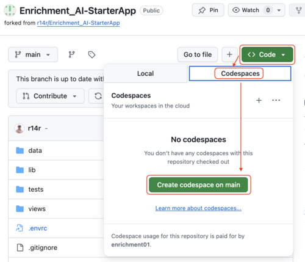

**Beschreibung:**

Jetzt, da Sie Ihren eigenen Fork haben, können Sie eine cloudbasierte Entwicklungsumgebung (Codespace) direkt aus dem Repository erstellen.

**Detaillierte Schritte:**

- Klicken Sie auf die grüne Schaltfläche "Code" im oberen rechten Bereich des Repositories
- Ein Dropdown-Menü erscheint mit mehreren Registerkarten:  Local, Codespaces und möglicherweise anderen
- Wählen Sie die Registerkarte "Codespaces"
- Sie sehen Optionen zum Erstellen eines neuen Codespace
- Klicken Sie auf die "+"-Schaltfläche oder die Schaltfläche "Create codespace on main"
- GitHub beginnt mit der Bereitstellung Ihres Codespace

## Schritt 13: Codespace

GitHub stellt eine virtuelle Maschine bereit, installiert erforderliche Software, klont Ihr Repository und richtet Visual Studio Code ein.  Dieser automatisierte Prozess erstellt eine voll funktionsfähige Entwicklungsumgebung.

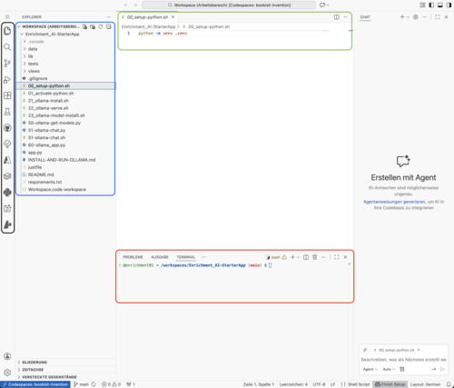

**Beschreibung:**

GitHub erstellt Ihren Codespace und lädt die Visual Studio Code-Umgebung in Ihrem Browser.

**Detaillierte Schritte:**

- Ein Ladebildschirm erscheint mit Statusmeldungen wie:
  - "Creating codespace..."
  - "Setting up environment..."
  - "Cloning repository..."
  - "Installing extensions..."
- Fortschrittsindikatoren zeigen den aktuellen Schritt
- Dieser Prozess dauert normalerweise 30 Sekunden bis 2 Minuten, abhängig von der Repository-Größe und -Komplexität
- Die Seite zeigt möglicherweise Tipps oder Informationen über Codespaces während des Ladens

## Schritt 14: Workspace öffnen

Das Öffnen des Workspace lädt formell die Repository-Struktur und aktiviert alle Konfigurationsdateien (wie .vscode-Einstellungen), die die Entwicklungsumgebung für dieses Projekt anpassen.

Sie sehen auf der linken Seite im Explorer View die Datei ``Workspace.code-workspace``.

Sie sehen den Inhalt der Datei im Editor-Bereich. Am rechten unteren Rand erscheint eine Schaltfläche zum Öffnen dieses ``Workspaces`` (im Deutschen ``Arbeitsbereich``).

Klicken Sie auf diese.

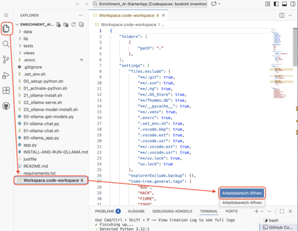

**Beschreibung:**

Der Codespace wurde geladen, und VS Code im Browser ist bereit.  Möglicherweise wird eine Aufforderung zum Öffnen des Workspace angezeigt.

**Detaillierte Schritte:**

- Die VS Code-Oberfläche wird in Ihrem Browser geladen
- Ein Popup erscheint möglicherweise mit der Frage "Open Workspace" oder dem Repository zu vertrauen
- Der Datei-Explorer ist möglicherweise auf der linken Seite sichtbar
- Der Editor-Bereich befindet sich in der Mitte
- Terminal und andere Panels befinden sich möglicherweise unten
- Wenn Sie aufgefordert werden, klicken Sie auf "Open Workspace" oder "Yes, I trust the authors"

## Schritt 15: Erweiterungen installieren

Repository-spezifische Erweiterungen verbessern Ihre Entwicklungserfahrung, indem sie Sprachunterstützung, Linting, Formatierung und andere hilfreiche Funktionen bereitstellen. Die Installation empfohlener Erweiterungen stellt sicher, dass Sie die Tools haben, die die Repository-Betreuer vorschlagen.

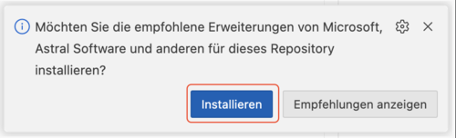

**Beschreibung:**

VS Code erkennt empfohlene Erweiterungen für dieses Repository und fordert Sie auf, diese zu installieren.

**Detaillierte Schritte:**

- Eine Benachrichtigung erscheint, normalerweise in der unteren rechten Ecke
- Die Nachricht lautet etwa "This repository recommends extensions"
- Sie sehen Optionen wie:
  - "Install" - installiert alle empfohlenen Erweiterungen
  - "Show Recommendations" - listet zunächst Erweiterungen auf
  - "Ignore" - schließt die Benachrichtigung
- Klicken Sie auf "Install", um automatisch alle empfohlenen Erweiterungen zu installieren
- Diese können Python, Markdown, Docker oder andere sprachspezifische Tools umfassen

## Schritt 16: Erweiterungen vertrauen

Diese Sicherheitsmaßnahme verhindert, dass bösartiger Code automatisch ausgeführt wird. Da Sie dieses Repository absichtlich geforkt und geöffnet haben, ist es sicher, ihm zu vertrauen.  Dies ermöglicht es Erweiterungen und Skripten, ordnungsgemäß zu laufen.

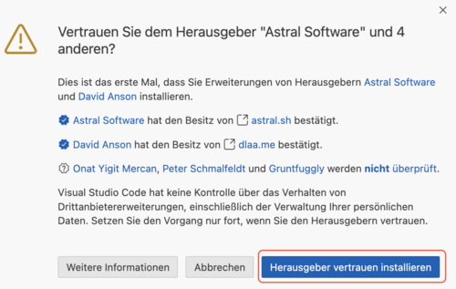

**Beschreibung:**

Bevor Erweiterungen installiert werden, fragt VS Code Sie, ob Sie dem Workspace und seinen Erweiterungs-Empfehlungen vertrauen.

**Detaillierte Schritte:**

- Ein Dialogfeld erscheint mit der Frage "Do you trust the authors of the files in this folder?"
- Sie sehen Informationen darüber, was Vertrauen bedeutet:
  - Code kann ausgeführt werden
  - Erweiterungen können aktiviert werden
  - Einstellungen können angewendet werden
- Verfügbare Optionen:
  - "Yes, I trust the authors" - fährt mit voller Funktionalität fort
  - "No, I don't trust the authors" - öffnet im eingeschränkten Modus
- Klicken Sie auf "Yes, I trust the authors", um fortzufahren

## Schritt 17: Erweiterungen werden installiert

VS Code lädt nun die empfohlenen Erweiterungen herunter und installiert sie im Hintergrund.

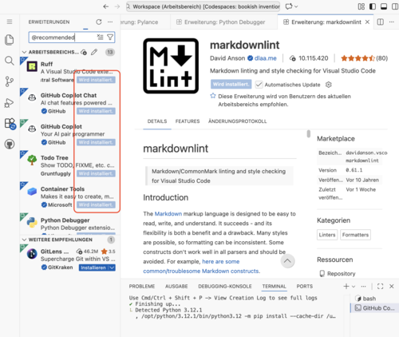

**Beschreibung:**

Erweiterungen fügen VS Code wichtige Funktionen hinzu, wie Python-Sprachunterstützung, Syntax-Hervorhebung, Debugging-Tools und Code-Formatierung. Diese Tools machen die Entwicklung viel einfacher und produktiver.

**Detaillierte Schritte:**

- Die Erweiterungsansicht öffnet sich möglicherweise automatisch in der linken Seitenleiste
- Sie sehen Fortschrittsindikatoren neben jeder zu installierenden Erweiterung
- Statusmeldungen wie "Installing..." mit rotierenden Symbolen erscheinen
- Mehrere Erweiterungen können gleichzeitig installiert werden
- Der Prozess dauert normalerweise 30 Sekunden bis 2 Minuten, abhängig von der Anzahl und Größe der Erweiterungen
- Sie können das Repository weiter durchsuchen, während dies geschieht

## Schritt 18: Installation der Erweiterungen abgeschlossen

Alle empfohlenen Erweiterungen wurden erfolgreich installiert und sind nun aktiv.

**Beschreibung:**

Mit installierten Erweiterungen ist Ihre Entwicklungsumgebung nun vollständig konfiguriert und bereit für Entwicklungsarbeiten. Sie haben Syntax-Hervorhebung, IntelliSense, Debugging-Unterstützung und andere Produktivitätsfunktionen aktiviert.

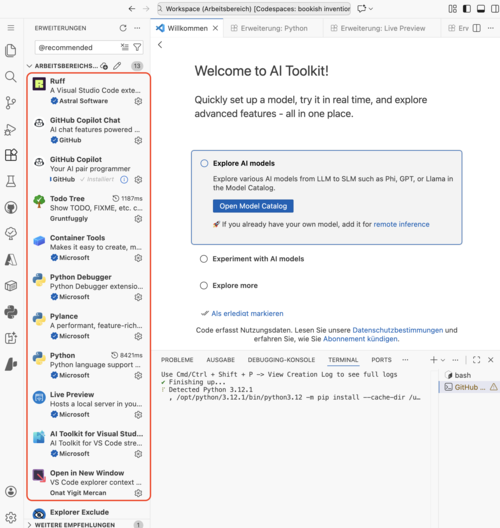

**Detaillierte Schritte:**

- Erfolgsbenachrichtigungen erscheinen für jede installierte Erweiterung
- Erweiterungen zeigen ein Häkchen oder den Status "Installed"
- Einige Erweiterungen erfordern möglicherweise ein Neuladen des Fensters (eine Aufforderung erscheint bei Bedarf)
- Möglicherweise sehen Sie Benachrichtigungen unten rechts über neu verfügbare Funktionen
- Die Erweiterungs-Seitenleiste zeigt alle installierten Erweiterungen mit ihren Versionsnummern

## Schritt 19: Alle Register schließen

Bereinigen Sie die Oberfläche, indem Sie Benachrichtigungs-Popups, Willkommens-Tabs oder andere Informationspanels schließen.

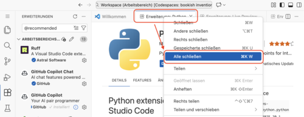

**Beschreibung:**

Das Entfernen unnötiger Panels und Benachrichtigungen entrümpelt Ihren Arbeitsbereich und erleichtert es, sich auf die anstehende Aufgabe zu konzentrieren - Ollama einzurichten und auszuführen.

**Detaillierte Schritte:**

- Suchen Sie nach mehreren Benachrichtigungs-Popups oder Informationsmeldungen
- Klicken Sie auf die "X"-Schaltfläche bei jeder Benachrichtigung, um sie zu schließen
- Schließen Sie alle Willkommens-Tabs oder Erste-Schritte-Seiten im Editor-Bereich
- Sie könnten Tabs schließen wie:
  - "Welcome"-Tab
  - "Get Started"-Tab
  - Erweiterungs-Informationsseiten
- Dies bietet einen sauberen Arbeitsbereich, um sich auf die eigentlichen Dateien und das Terminal zu konzentrieren

## Schritt 20: Symbol Datei-Explorer

Dieser Schritt hebt das Datei-Explorer-Symbol in der Aktivitätsleiste von VS Code hervor.

**Beschreibung:**

Der Datei-Explorer ist Ihr primäres Werkzeug zum Navigieren in der Dateistruktur des Repositories.  Zu verstehen, wo sich dieses Symbol befindet, hilft Ihnen, schnell auf Dateien während des gesamten Tutorials zuzugreifen.

**Detaillierte Schritte:**

- Schauen Sie sich die linke Seitenleiste (Aktivitätsleiste) von VS Code an
- Das Datei-Explorer-Symbol befindet sich normalerweise oben - es sieht aus wie zwei überlappende Dokumente oder Seiten
- Dieses Symbol ist möglicherweise im Screenshot hervorgehoben oder eingekreist
- Das Symbol ist möglicherweise bereits ausgewählt (blau oder in einer anderen Farbe hervorgehoben)
- Andere Symbole in der Aktivitätsleiste umfassen:
  - Suche (Lupe)
  - Quellcodeverwaltung (Zweig-Symbol)
  - Ausführen und Debuggen (Play-Button mit Käfer)
  - Erweiterungen (Blöcke-Symbol)

## Schritt 21: Explorer-Ansicht der Dateien

Das Datei-Explorer-Panel ist nun geöffnet und zeigt die vollständige Datei- und Ordnerstruktur des Repositories an.

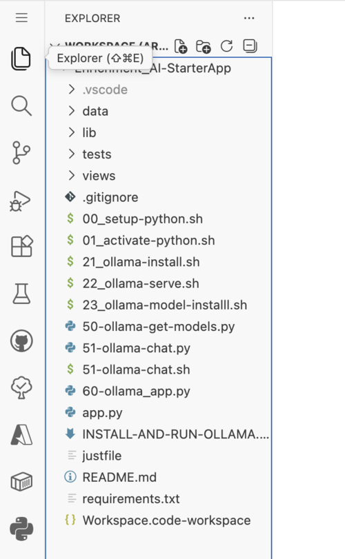

**Beschreibung:**

Der Datei-Explorer gibt Ihnen Sichtbarkeit auf alle im Repository verfügbaren Ressourcen.  Für diese Ollama-Setup-Anleitung finden Sie hier die Installations- und Konfigurationsskripte.

**Detaillierte Schritte:**

- Das linke Panel zeigt den Dateibaum für Ihr Repository
- Sie können Ordner (mit Ordner-Symbolen) und Dateien (mit entsprechenden Dateityp-Symbolen) sehen
- Wichtige Elemente, die Sie beachten sollten:
  - Setup-Skripte (wahrscheinlich nummeriert oder klar benannt)
  - Konfigurationsdateien
  - README-Dateien
  - Möglicherweise Ordner wie `scripts/`, `docs/` oder ähnliche
- Sie können Ordner erweitern, indem Sie auf den Pfeil/Chevron daneben klicken
- Klicken Sie auf eine beliebige Datei, um sie im Editor zu öffnen

## Schritt 22: Terminal-Ansicht

Das Terminal ist der Ort, an dem Sie alle Installationsskripte ausführen, Ollama-Befehle ausführen und mit dem System interagieren werden. Es ist die Befehlszeilenschnittstelle zu Ihrer Codespace-Umgebung.

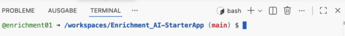

**Beschreibung:**

Öffnen Sie das integrierte Terminal, in dem Sie alle Installationsbefehle ausführen werden.

**Detaillierte Schritte:**

- Um das Terminal zu öffnen, verwenden Sie eine dieser Methoden:
  - Drücken Sie `` Strg + ` `` (Backtick) unter Windows/Linux oder `` Cmd + ` `` auf Mac
  - Gehen Sie zum Menü:  **Terminal** → **New Terminal**
  - Klicken Sie auf das Terminal-Symbol in der Aktivitätsleiste, falls sichtbar
- Das Terminal-Panel erscheint am unteren Rand des VS Code-Fensters
- Sie sehen eine Eingabeaufforderung, die auf Eingabe wartet
- Das Terminal befindet sich bereits im Kontext Ihres Repository-Verzeichnisses
- Die Standard-Shell ist normalerweise bash in Linux-basierten Codespaces

## Hinweis zur Terminal-Eingabe

Im Terminal beginnen die Zeilen bereits mit einem Text. In unserem Falle z. B. :

``@enrichment01 ➜ /workspaces/Enrichment_AI-StarterApp (main) $``

Dieser Text wird als Eingabeprompt oder kurz Prompt bezeichnet und besteht aus mehreren Teilen:

- ``@enrichment01``

  Der Benutzername, mit dem Sie gerade angemeldet sind und arbeiten

- ``/workspaces/Enrichment_AI-StarterApp``

  Das aktuelle Verzeichnis. Hier ist dies der Ordner, in dem sich unsere Anwendung befindet

- ``(main)``

  Der aktuelle Branch. Wir werden hierauf nicht näher eingehen.

- ``$``

  Ein Zeichen, das den Prompt abschließt und den Benutzer darauf hinweist, dass er hier mit der Eingabe beginnen kann.

  Dieses Zeichen wird in den nachfolgenden Beispielen immer angezeigt, darf aber **NICHT** eingegeben werden.

  Wenn also der Text ``$ ollama list`` angezeigt wird, dann müssen Sie nur das Kommando eingeben: ``ollama list``

## Schritt 23: Befehl im Terminal ausführen

Führen Sie Ihren ersten Befehl im Terminal aus, um verfügbare Skripte aufzulisten oder den Setup-Prozess zu beginnen.

- Tippen Sie ``echo Hallo`` und dann die Eingabetaste (``Enter``)

- In der nächsten Zeile wird die entsprechende Ausgabe angezeigt:
  ``Hallo``

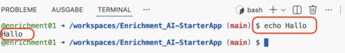

**Beschreibung:**

Dies bestätigt, dass das Terminal korrekt funktioniert und hilft Ihnen, sich an den verfügbaren Dateien und Skripten zu orientieren.  Es ist der erste Schritt im eigentlichen Installationsprozess.

**Detaillierte Schritte:**

- Klicken Sie in das Terminal, um sicherzustellen, dass es fokussiert ist
- Sie könnten einen ersten Befehl ausführen wie:
  - `ls` - um Dateien und Verzeichnisse aufzulisten
  - `ls -la` - um Dateien mit Details aufzulisten
  - `echo Hallo` - Ausgabe eines Wortes
  
- Geben Sie den Befehl ein und drücken Sie Enter zum Ausführen
- Beobachten Sie die Ausgabe im Terminal
- Befehle sind in Linux-Umgebungen **groß-/kleinschreibungsempfindlich**

## Schritt 24: Terminal - setup-python ausführen

Führen Sie das Python-Setup-Skript aus, um die für den Installationsprozess benötigte Python-Umgebung zu konfigurieren.

**Detaillierte Schritte:**

- Geben Sie den Befehl ein:  `bash setup-python` oder `./setup-python` (abhängig von der Konfiguration des Skripts)
- Drücken Sie Enter zum Ausführen
- Das Skript beginnt zu laufen und zeigt möglicherweise:
  - Versionsinformationen
  - Installationsfortschritt
  - Konfigurationsmeldungen
- Achten Sie auf Aufforderungen oder Fragen, die möglicherweise Ihre Eingabe erfordern
- Das Skript könnte:
  - Python-Pakete installieren
  - Virtuelle Umgebungen erstellen
  - Umgebungsvariablen setzen
  - Python-Pfade konfigurieren

## Schritt 25: Terminal - Popup - 01_activate-python auswählen

Ein Popup oder Menü erscheint, das wahrscheinlich verfügbare Skripte anzeigt.  Sie müssen das Python-Aktivierungsskript auswählen.

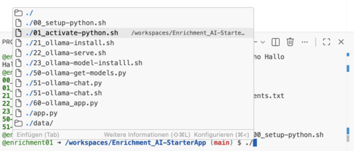

**Detaillierte Schritte:**

- Ein Auswahlmenü oder Popup erscheint im Terminal oder VS Code
- Suchen Sie nach einer Option mit der Bezeichnung "01_activate-python" oder ähnlich
- Verwenden Sie Pfeiltasten zum Navigieren, wenn es sich um ein Befehlszeilen-Menü handelt
- Oder klicken Sie mit der Maus, wenn es sich um ein grafisches Popup handelt
- Drücken Sie Enter oder klicken Sie, um "01_activate-python" auszuwählen
- Das Menü zeigt möglicherweise andere Optionen wie:
  - 02_other-script
  - 03_another-script
  - usw.

## Schritt 26: Terminal - 01_activate-python ausführen

Das Python-Aktivierungsskript wird nun ausgeführt und richtet die virtuelle Python-Umgebung ein oder aktiviert sie.

**Beschreibung:**
Die Aktivierung einer virtuellen Python-Umgebung isoliert Paketinstallationen und Abhängigkeiten. Dies verhindert Konflikte mit systemweiten Python-Paketen und stellt eine saubere, kontrollierte Umgebung für den Installationsprozess sicher.

**Detaillierte Schritte:**

- Der Befehl `./01_activate-python` wird ausgeführt
- Sie sehen möglicherweise Ausgaben wie:
  - "Activating Python environment..."
  - Pfadinformationen zur virtuellen Umgebung
  - Bestätigungsmeldungen

## Schritt 27: Terminal - 21_ollama-install ausführen

Beginnen Sie die Ollama-Installation, indem Sie das Installationsskript ausführen.

**Beschreibung:**

Dieses Skript automatisiert den Ollama-Installationsprozess und kümmert sich um alle notwendigen Schritte, einschließlich des Herunterladens der Binärdatei, der Einrichtung der Konfiguration und der Sicherstellung, dass Abhängigkeiten erfüllt sind.  Es erspart Ihnen manuelle Installationsschritte.

**Detaillierte Schritte:**

- Geben Sie den Befehl ein: `./21_ollama-install`
- Drücken Sie Enter zum Ausführen
- Das Skript initiiert den Ollama-Installationsprozess
- Sie sehen, wie das Skript mit ersten Ausgabemeldungen beginnt
- Das Skript wird wahrscheinlich:
  - Das Ollama-Installationspaket herunterladen
  - Systemanforderungen überprüfen
  - Installationsverzeichnisse vorbereiten

## Schritt 28: Terminal - Ollama-Installation

Die Ollama-Installation läuft aktiv, mit Statusmeldungen, die im Terminal erscheinen.

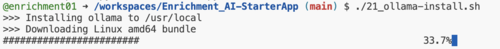

**Beschreibung:**

Ollama wird von offiziellen Quellen heruntergeladen und in Ihrem Codespace installiert. Die Installation umfasst die Ollama-Binärdatei, notwendige Bibliotheken und Konfigurationsdateien, die zum Ausführen von KI-Modellen lokal benötigt werden.

**Detaillierte Schritte:**

- Beobachten Sie die Terminal-Ausgabe, die zeigt:
  - Download-Fortschritt (kann Prozentsatz oder Fortschrittsbalken zeigen)
  - "Installing Ollama... "-Meldungen
  - Systempfade, die konfiguriert werden
  - Abhängigkeitsinstallationen
  - Dateiextraktionsfortschritt
- Der Prozess kann 1-3 Minuten dauern, abhängig von der Internetgeschwindigkeit
- Unterbrechen Sie den Prozess nicht und schließen Sie das Terminal nicht
- Sie sehen möglicherweise Befehle wie:
  - `curl -fsSL https://ollama.com/install.sh | sh`
  - Binärdownload- und Extraktionsmeldungen
  - Pfadkonfigurations-Ausgabe

## Schritt 29: Terminal - Ollama-Installation abgeschlossen

Die Ollama-Installation wurde erfolgreich abgeschlossen.

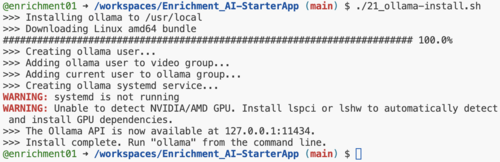

**Beschreibung:**

Bestätigung, dass Ollama jetzt installiert und einsatzbereit ist. Sie können jetzt den Ollama-Dienst starten und beginnen, KI-Modelle herunterzuladen und auszuführen.

**Detaillierte Schritte:**

- Suchen Sie nach Bestätigungsmeldungen wie:
  - "Ollama installed successfully"
  - "Installation complete"
  - Versionsinformationen:  `Ollama version X.X.X`
- Die Eingabeaufforderung kehrt zurück (zeigt keinen Installationsfortschritt mehr)
- Sie können die Installation überprüfen, indem Sie ausführen:  `ollama --version`
- Die Ausgabe sollte die installierte Versionsnummer zeigen

## Schritt 30: Terminal - 22_ollama-serve ausführen

Starten Sie den Ollama-Server mit dem bereitgestellten Skript.  Der Server muss laufen, um Modelloperationen zu handhaben.

**Beschreibung:**

Der Ollama-Server (oft `ollama serve` genannt) ist der Hintergrunddienst, der KI-Modelle verwaltet, API-Anfragen bearbeitet und Inferenz durchführt. Er muss laufen, bevor Sie Modelle pullen oder ausführen können.

**Detaillierte Schritte:**

- Geben Sie den Befehl ein: `./22_ollama-serve` oder `ollama serve`
- Drücken Sie Enter zum Ausführen
- Das Skript startet den Ollama-Dienst
- Sie sehen, wie der Befehl im Terminal ausgeführt wird

## Schritt 31: Terminal - Popup über Schriftarten

Dies ist eine kosmetische Benachrichtigung über Terminal-Anzeige-Schriftarten. Sie beeinflusst die Funktionalität nicht - einige Sonderzeichen oder Symbole werden möglicherweise nicht perfekt gerendert, aber alle Befehle funktionieren korrekt.  Dies kann sicher ignoriert werden.

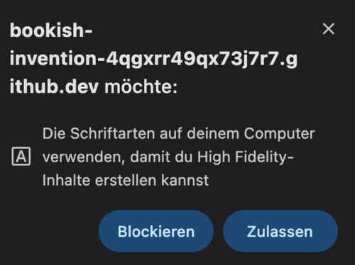

**Beschreibung:**

Ein Benachrichtigungs-Popup erscheint bezüglich Terminal-Schrifteinstellungen oder fehlender Schriftarten.

**Detaillierte Schritte:**

- Eine Benachrichtigung erscheint über Schriftarten
- Die Nachricht könnte lauten:
  - "Do you want to install recommended fonts?"
  - "Some characters may not display correctly"
  - "Terminal font not found"
- Bereitgestellte Optionen:
  - "Allow" oder "Zulassen"
  - "Install" oder "Yes"
  - "Not now" oder "No"
  - "Don't show again"
- Sie können dies sicher schließen oder Schriftarten bei Bedarf installieren
- Klicken Sie auf "Not now" oder schließen Sie die Benachrichtigung, um fortzufahren

## Schritt 32: Terminal - Ollama Serve

Der Ollama-Server läuft jetzt und zeigt Log-Ausgaben an.

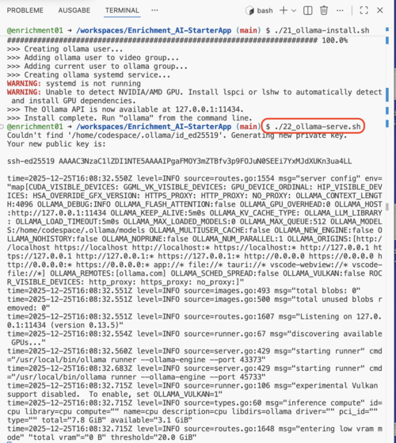

**Beschreibung:**

Der Ollama-Server ist nun betriebsbereit und bereit, Anfragen zu verarbeiten. Er verwaltet das Laden, Entladen und Inferenzoperationen von Modellen.  Dieses Terminal zeigt weiterhin Server-Logs an, sodass Sie ein zweites Terminal für zusätzliche Befehle benötigen.

**Detaillierte Schritte:**

- Das Terminal zeigt aktive Ausgabe vom Ollama-Dienst:
  - `Ollama is serving on port 11434`
  - Zeitstempel-Logs, die Server-Aktivität zeigen
  - API-Endpunkt-Informationen
  - Verbindungsstatusmeldungen
- Der Server läuft weiterhin im Vordergrund
- Das Terminal ist nun vom Serverprozess belegt
- Sie haben keine Eingabeaufforderung in diesem Terminal, während der Server läuft
- Der Server hört auf Anfragen unter `http://localhost:11434`

## Hinweis: Ollama Server starten wenn die Umgebung neu gestartet wird

Der Start des Ollama Server muss jedesmal wiederholt werden, wenn die Codespace-Umgebung neu gestartet wird, z. B. nach einer Anmeldung.

Führen Sie dazu immer die beiden folgenden Schritte aus:

- Neues Terminal öffnen

- Eingabe des Befehls ``ollama serve``

- Wechseln Sie dann wieder zum ersten Terminal und setzen Sie die Arbeit fort.

## Schritt 33: Terminal - Neues Terminal öffnen

Da das erste Terminal vom laufenden Ollama-Server belegt ist, öffnen Sie ein zweites Terminal, um zusätzliche Befehle auszuführen.

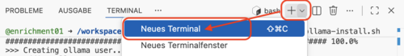

**Beschreibung:**

Das Öffnen eines zweiten Terminals ermöglicht es Ihnen, Befehle auszuführen, während der Ollama-Server im ersten Terminal weiterläuft. Dies ist wesentlich für eine Client-Server-Architektur, bei der der Server aktiv bleiben muss.

**Detaillierte Schritte:**

- Suchen Sie nach dem "+"-Symbol im Terminal-Panel-Header
- Klicken Sie auf die "+"-Schaltfläche, um eine neue Terminal-Instanz zu erstellen
- Alternativ verwenden Sie:
  - Menü: **Terminal** → **New Terminal**
  - Tastenkombination: `` Strg+Shift+` ``
- Ein neuer Terminal-Tab erscheint neben dem bestehenden
- Das neue Terminal hat seine eigene unabhängige Eingabeaufforderung
- Sie können zwischen Terminals mit dem Dropdown-Menü oder Tabs wechseln

## Schritt 34: Terminal - Seitenleiste mit Liste der Terminals

Die Verwaltung mehrerer Terminals ist wesentlich für komplexe Setups. Ein Terminal führt den Server aus, während andere zum Ausführen von Befehlen, Überwachen von Logs oder Ausführen zusätzlicher Dienste verwendet werden.

Die Seitenleiste macht das Wechseln zwischen ihnen einfach.

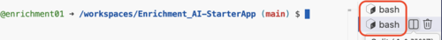

**Detaillierte Schritte:**

- Schauen Sie sich die rechte Seite des Terminal-Panels oder das Dropdown-Menü an
- Sie sehen eine Liste der geöffneten Terminals:
  - Terminal 1: `bash` (führt ollama serve aus)
  - Terminal 2: `bash` (Ihr neues Terminal)
- Jedes Terminal zeigt:
  - Terminal-Nummer oder Name
  - Aktueller Shell-Typ
  - Status-Indikator
- Klicken Sie auf ein beliebiges Terminal, um zu ihm zu wechseln
- Bewegen Sie die Maus über Terminals, um Optionen zu sehen wie:
  - Terminal beenden (Papierkorb-Symbol)
  - Terminal umbenennen
  - Terminal teilen

## Schritt 35: Terminal - Ollama Pull Model

Laden Sie ein KI-Modell aus der Ollama-Bibliothek mit dem Pull-Befehl herunter.

**Beschreibung:**

KI-Modelle sind große Dateien, die die trainierten neuronalen Netzwerk-Gewichte enthalten. Das Pullen eines Modells lädt es in Ihre lokale Umgebung herunter, damit Sie Inferenz ausführen können.  Verschiedene Modelle haben unterschiedliche Fähigkeiten, Größen und Leistungsmerkmale.

**Detaillierte Schritte:**

- Im neuen Terminal (nicht dem, das den Server ausführt), geben Sie ein:
  - ``23_ollama-model-install.sh``

  - ``ollama pull phi4-mini``

- Drücken Sie Enter zum Ausführen
- Der Download beginnt sofort
- Sie sehen Ausgaben wie:
  - `pulling manifest`
  - `pulling [hash]...`
  - Fortschrittsbalken, der den Download-Prozentsatz anzeigt
  - Download-Geschwindigkeit und geschätzte verbleibende Zeit
- Modelle können mehrere Gigabyte groß sein, daher kann dies mehrere Minuten dauern
- Beliebte Modelle zum Ausprobieren:
  - `gemma3:1b`
  - `mistral`
  - `phi`
  - `codellama`

## Schritt 36: Terminal - Ollama Pull Model abgeschlossen

Der Modell-Download wurde erfolgreich abgeschlossen.

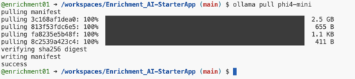

**Beschreibung:**

Das Modell ist nun lokal gespeichert und einsatzbereit. Sie können Inferenz mit diesem Modell ausführen, es für Chat-Interaktionen verwenden oder es in Anwendungen integrieren.  Der Download muss nur einmal pro Modell erfolgen.

**Detaillierte Schritte:**

- Das Terminal zeigt Abschlussmeldungen:
  - `success` oder `✓ downloaded successfully`
  - Gesamte Download-Größe
  - Modell-Hash-Verifizierung
  - Abschließende Bestätigungsmeldung
- Die Eingabeaufforderung kehrt zurück, bereit für den nächsten Befehl
- Sie können jetzt verfügbare Modelle auflisten mit:  `ollama list`

## Schritt 37: Terminal - Ollama List Model

Zeigen Sie alle heruntergeladenen Modelle an, die auf Ihrem System verfügbar sind.

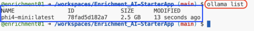

**Beschreibung:**

Das Auflisten von Modellen hilft Ihnen zu überprüfen, was verfügbar ist, und Ihre Modellsammlung zu verwalten.

Sie können die Festplattennutzung sehen und erfolgreiche Downloads bestätigen. Dies ist nützlich, wenn Sie mehrere Modelle installiert haben.

**Detaillierte Schritte:**

- Geben Sie den Befehl ein: `ollama list`
- Drücken Sie Enter zum Ausführen
- Die Ausgabe zeigt eine Tabelle mit:
  - **NAME**: Modellname und Tag (z.B. `llama2: latest`)
  - **ID**: Eindeutiger Identifikations-Hash
  - **SIZE**: Download-Größe (z.B. `3.8 GB`)
  - **MODIFIED**: Wann das Modell zuletzt gepullt oder aktualisiert wurde
- Sie sehen alle Modelle, die Sie heruntergeladen haben
- Dies bestätigt, dass Ihr Modell einsatzbereit ist

## Schritt 38: Terminal - Ollama Run Model

Starten Sie ein Modell im interaktiven Modus, um mit der KI zu chatten.

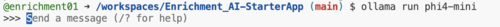

**Beschreibung:**

Der `run`-Befehl lädt das Modell in den Speicher und startet eine interaktive Sitzung. Dies ist der einfachste Weg, mit KI-Modellen zu interagieren - Sie geben Fragen oder Prompts ein, und das Modell generiert Antworten in Echtzeit.

**Detaillierte Schritte:**

- Geben Sie den Befehl ein: `ollama run phi4-mini` (oder Ihr gewählter Modellname)
- Drücken Sie Enter zum Ausführen
- Das Modell lädt (dies kann einige Sekunden dauern)
- Sie sehen:
  - Lademeldungen
  - Modellinformationen
  - Eine Eingabeaufforderung erscheint:  `>>>` oder ähnlich
- Das Terminal wechselt in den interaktiven Chat-Modus
- Sie sind nun bereit, Prompts einzugeben
- Der Cursor wartet auf Ihre Eingabe

## Schritt 39: Terminal - Ollama Run Model mit Prompt

Interagieren Sie mit dem KI-Modell, indem Sie einen Prompt senden und eine Antwort erhalten.

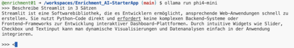

**Beschreibung:**

Dies demonstriert die Kernfunktionalität von KI-Sprachmodellen - auf natürlichsprachliche Prompts zu antworten. Das Modell generiert kontextuell relevante Antworten basierend auf seinen Trainingsdaten.

**Detaillierte Schritte:**

- Bei der `>>>`-Eingabeaufforderung geben Sie Ihre Frage oder Anfrage ein, zum Beispiel:
  - "Erkläre Quantencomputing in einfachen Worten"
  - "Schreibe eine Python-Funktion zur Berechnung von Fibonacci"
  - "Was ist die Hauptstadt von Frankreich?"
  - "Erzähle mir einen Witz über Programmierung"
- Drücken Sie Enter, um Ihren Prompt zu übermitteln
- Das Modell beginnt sofort mit der Generierung einer Antwort
- Sie sehen die Antwort in Echtzeit streamen (Token für Token)
- Text erscheint progressiv, während das Modell ihn generiert
- Die Antwortgenerierung kann einige Sekunden dauern, abhängig von:
  - Modellgröße
  - Prompt-Komplexität
  - Hardware-Ressourcen

## Schritt 40: Terminal - Ollama Run Model mit Prompt

Probieren Sie einen weiteren Prompt aus.

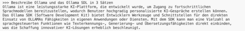

**Detaillierte Schritte:**

- Die KI gibt weiterhin ihre Antwort aus
- Bei längeren Antworten scrollt der Text, während er generiert wird
- Sobald abgeschlossen, erscheint die `>>>`-Eingabeaufforderung erneut
- Sie können jetzt:
  - Folgefragen stellen (das Modell erinnert sich an den Kontext)
  - Völlig andere Fragen stellen
  - Die Konversation natürlich fortsetzen
- Das Modell behält die Konversationshistorie innerhalb der Sitzung bei
- Jeder neue Prompt profitiert vom vorherigen Kontext

## Schritt 41: Terminal - Ollama Run Model Hilfe anzeigen

Zeigen Sie Hilfeinformationen mit verfügbaren Befehlen im interaktiven Modus an.

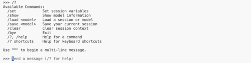

**Beschreibung:**

Das Verständnis verfügbarer Befehle hilft Ihnen, die Sitzung zu steuern, den Konversationskontext zu verwalten, Parameter anzupassen und ordnungsgemäß zu beenden. Der Hilfebefehl ist Ihr schneller Referenzleitfaden.

**Detaillierte Schritte:**

- Bei der `>>>`-Eingabeaufforderung geben Sie spezielle Befehle ein:
  - `/help` - zeigt alle verfügbaren Befehle an
  - `/?` - kann auch Hilfe anzeigen (abhängig von der Version)
- Drücken Sie Enter zum Ausführen
- Die Hilfe-Ausgabe zeigt Befehle wie:
  - `/bye` - Sitzung beenden
  - `/exit` - Sitzung beenden
  - `/help` - Hilfe anzeigen
  - `/clear` - Konversationshistorie löschen
  - `/show` - Modellinformationen anzeigen
  - `/set` - Parameter ändern (Temperatur, usw.)
- Diese Befehle steuern die interaktive Sitzung

## Schritt 42: Terminal - Ollama Run Model Beenden

Beenden Sie die interaktive Modellsitzung und kehren Sie zur regulären Eingabeaufforderung zurück.

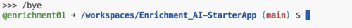

**Beschreibung:**

Das ordnungsgemäße Beenden der interaktiven Sitzung entlädt das Modell aus dem Speicher und gibt Systemressourcen frei. Sie können nun andere Ollama-Befehle ausführen, den Status überprüfen oder zusätzliche Modelle pullen.

**Detaillierte Schritte:**

- Bei der `>>>`-Eingabeaufforderung geben Sie einen von diesen ein:
  - `/bye`
  - `/exit`
  - Oder drücken Sie `Strg+D`
- Drücken Sie Enter (wenn Sie einen Befehl verwenden)
- Das Modell wird aus dem Speicher entladen
- Sie sehen eine Abschiedsnachricht oder Bestätigung
- Die reguläre Terminal-Eingabeaufforderung kehrt zurück (z.B. `username@codespace:~$`)
- Sie sind zurück in der normalen Shell und können andere Befehle ausführen

---
